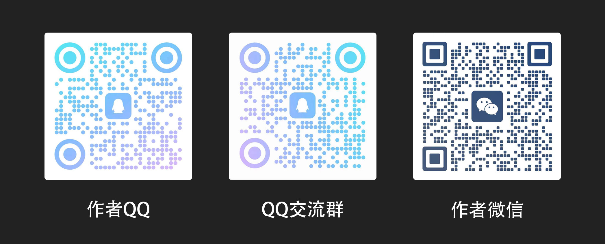
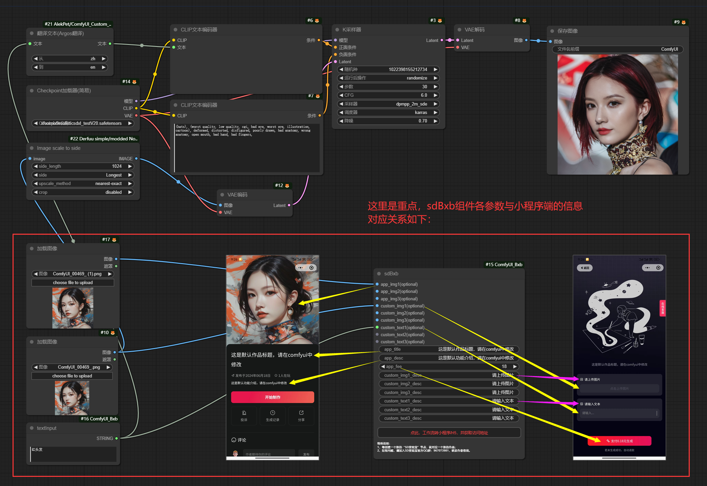
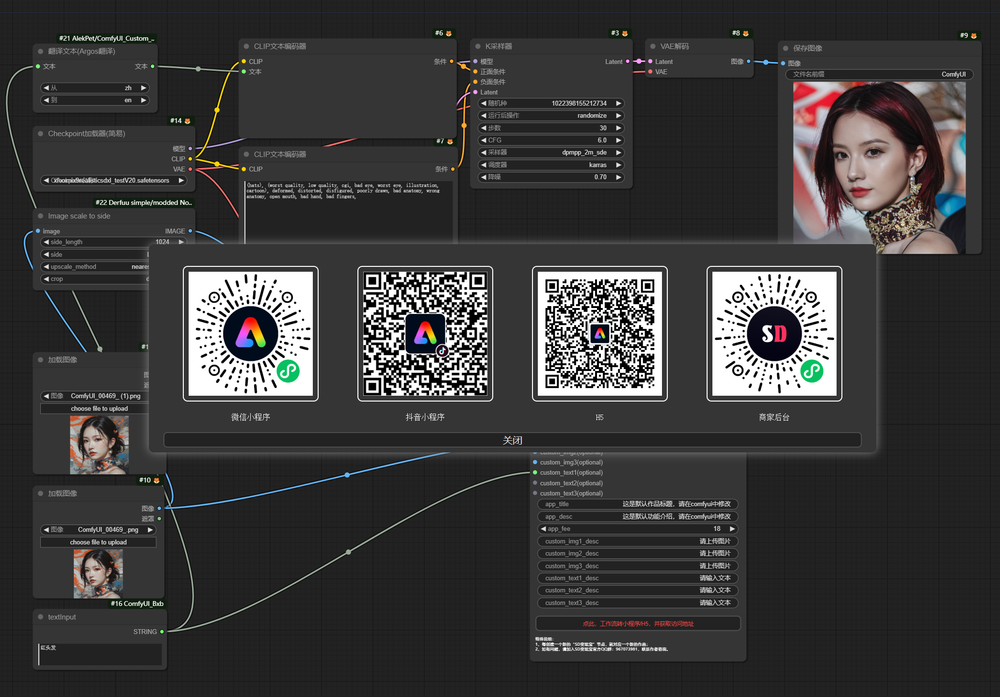
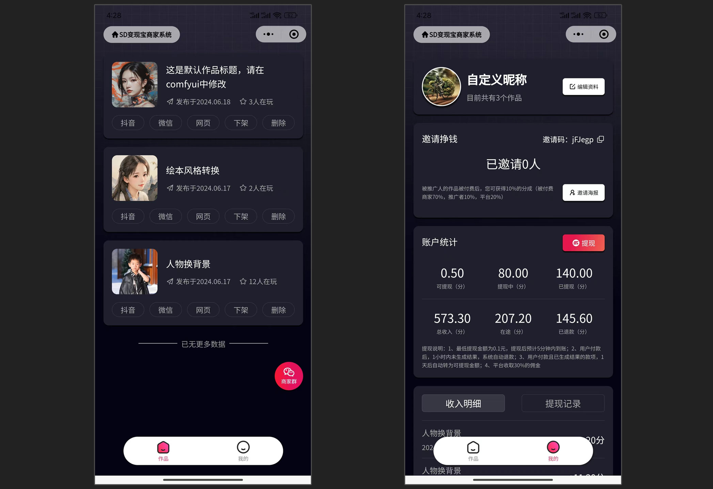
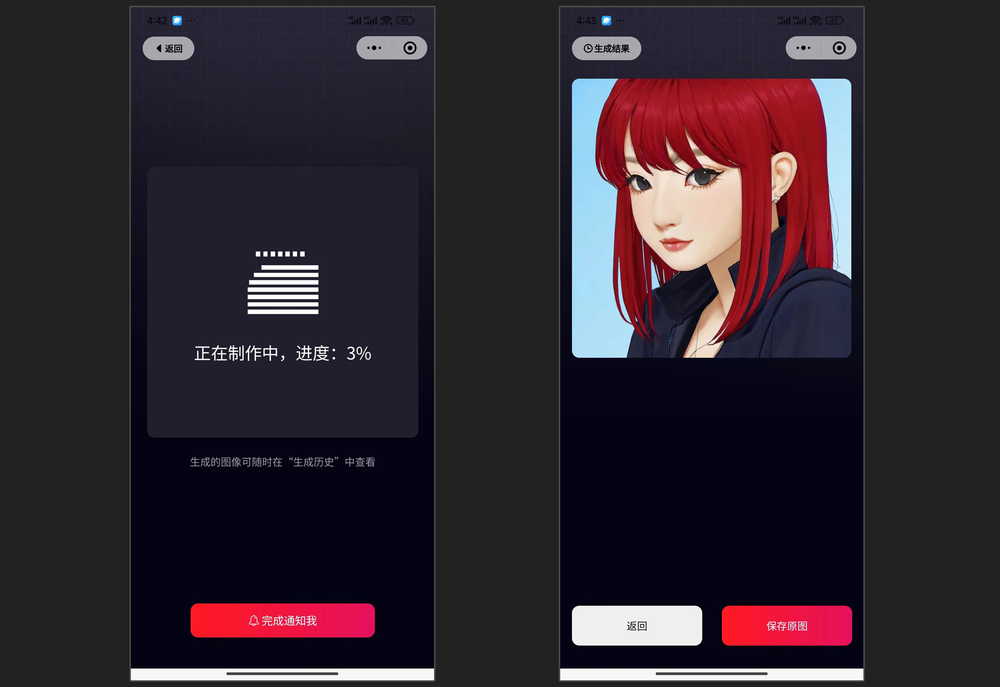

# SD变现宝
## 插件功能
SD变现宝插件可以一键把comfyui工作流转为“微信小程序”、“抖音小程序”、“微信内H5”、“微信外H5”，且都支持支付变现。  
在您现有工作流的基础上，加入ComfyUI_Bxb插件，即可实现一键转换。
## 更新记录
### 更新计划
1、支持一次出多图；  
2、支持视频输入和视频输出；  
3、会员？储值？免费？  
4、抖音小程序推广计划；
### 已更新
2021.6.23：已支持多GPU服务器并发（保存工作流，然后在不同的GPU服务器上点击一键转换，即可实现一个作品对应多个GPU服务器；注意：模型路径等信息在不同的GPU服务器上要保持一致）
## 特别说明
### 插件还在内测中，如在使用过程中出现bug，或者您有意见或者建议都请联系我。  
 
## 视频教程
B站：https://www.bilibili.com/video/BV1Bsg8eeEjv  
YouTube：https://youtu.be/5lJn-NHtc9w
## 安装方式
1、通过ComfyUI-Manager在线安装，在ComfyUI-Manager中搜索“ComfyUI_Bxb”即可找到本插件（推荐）；  
2、通过git clone下载插件包，放到ComfyUI/custom_nodes目录下，重启ComfyUI即可安装本插件；  
3、官方QQ群：967073981，下载插件包，放到ComfyUI/custom_nodes目录下，重启ComfyUI即可安装本插件；  
## 使用示例和截屏说明
### SD变现宝示例工作流
点此下载[SD变现宝示例工作流](assets/SD变现宝示例工作流.json)。该工作流只为展现ComfyUI_Bxb插件的功能，比较简单，所以出图质量不好。但您可以把ComfyUI_Bxb插件放到您的任意工作流中，实现一键转换。
### ComfyUI插件端截屏
 
 
### 商家管理端截屏
 
### 用户端截屏
 
 